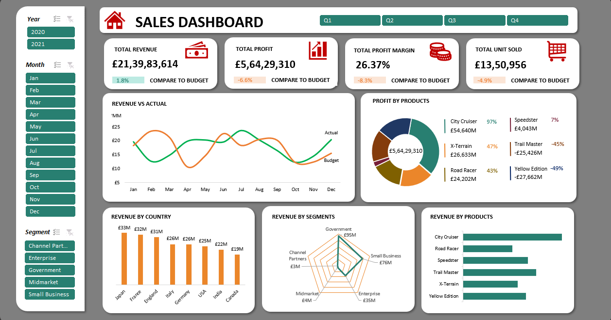
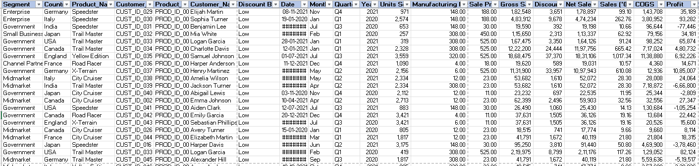

# Business-Intelligence-Dashboard-Excel

> **Power Pivot | Advanced Pivot Tables | Interactive Slicers | Revenue vs Budget Analysis**

---

## Project Overview

An interactive sales analytics dashboard built entirely in **Microsoft Excel** using Power Pivot, 
Pivot Tables, and Slicers. The dashboard analyzes 2 years (2020–2021) of sales data across 
6 products, 8 countries, and 5 business segments — providing actionable insights on revenue 
performance, profitability, and budget variance.

---

## Dashboard Preview

---

## Dataset Overview

**Source**: GitHub Public Dataset  
**Records**: 10,000+ transactions  
**Period**: 2020–2021  
**Columns**: Segment, Country, Product, Customer, Date, Units Sold,
             Sale Price, Gross Sales, Discounts, Net Sales, COGS, Profit

---

## Key KPIs

| Metric | Actual | vs Budget |
|--------|--------|-----------|
| **Total Revenue** | £21,39,83,614 | +1.8% |
| **Total Profit** | £5,64,29,310 | -6.6% |
| **Profit Margin** | 26.37% | -8.3% |
| **Total Units Sold** | 13,50,956 | -4.9% |

---

## Dashboard Visuals

| Visual | Type | Description |
|--------|------|-------------|
| Revenue vs Actual | Line Chart | Monthly actual vs budget trend (2020–2021) |
| Profit by Products | Donut Chart | Profit share across 6 products |
| Revenue by Country | Bar Chart | Country-wise revenue comparison |
| Revenue by Segments | Radar Chart | Revenue distribution across 5 segments |
| Revenue by Products | Bar Chart | Product-wise revenue ranking |
| KPI Cards | Scorecards | 4 top-level metrics with budget variance |

---

## Interactive Slicers

- **Year**: 2020 / 2021
- **Quarter**: Q1 / Q2 / Q3 / Q4
- **Month**: January to December
- **Segment**: Channel Partners | Enterprise | Government | Midmarket | Small Business

> All visuals update dynamically on slicer selection.

---

## Key Business Insights

### Revenue by Country
| Rank | Country | Revenue |
|------|---------|---------|
| 1 | Japan | £33M |
| 2 | France | £32M |
| 3 | England | £31M |
| 4 | Italy | £26M |
| 5 | Germany | £26M |
| 6 | USA | £25M |
| 7 | India | £22M |
| 8 | Canada | £19M |

### Revenue by Segment
- **Government** — Highest revenue generator
- **Small Business** — Strong contributor (£76M)
- **Enterprise** — Steady performance (£35M)
- **Midmarket & Channel Partners** — Low revenue, negative profit margins

### Profit by Products
| Product | Profit | Status |
|---------|--------|--------|
| City Cruiser | £54.64M | Most profitable |
| X-Terrain | £26.63M | Profitable (+47.2%) |
| Road Racer | £24.20M | Low margin |
| Speedster | -£4.04M | Loss |
| Trail Master | -£25.42M | Loss |
| Yellow Edition | -£27.66M | Highest loss |

> **City Cruiser dominates profitability at 96.83% share of total profit.**

### Revenue Trend
- Monthly revenue fluctuates — peaks observed mid-year
- Budget vs actual gaps visible in multiple months
- 2021 outperforms 2020 in overall revenue

---

## Tools & Excel Skills Used
- Power Pivot — Data modeling across tables
- Advanced Pivot Tables — Multi-dimensional aggregations
- Slicers — Dynamic cross-filtering (Year, Quarter, Month, Segment)
- Calculated Measures — Variance %, Profit Margin, Budget Gap
- KPI Cards — Conditional formatting for status indicators
- Charts — Line, Donut, Bar, Radar (all slicer-connected)
- Dataset sourced from GitHub — cleaned and modeled in Excel

---

## Related Projects

- [E-Commerce Sales Dashboard — SQL + Excel](https://github.com/Payaljain05/E-Commerce-Sales-Analytics-Dashboard)
- [Power BI Sales Dashboard](https://github.com/Payaljain05/Sales-Customer-performance-dashboard)

---

## Author

**Payal Jain**  
MCA Student | Aspiring Data Analyst | Delhi, India  
[github.com/Payaljain05](https://github.com/Payaljain05)  
[LinkedIn](https://linkedin.com/in/payal-jain)

---

*If you found this helpful, star the repo!*
